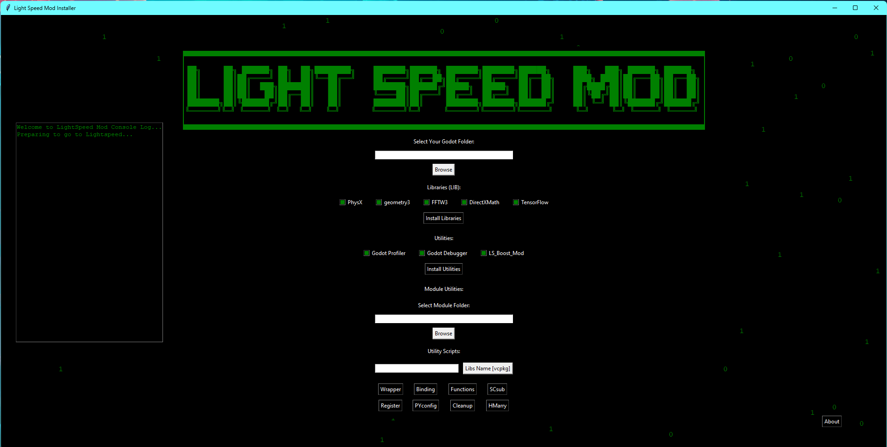

# LightSpeed Mod Installer 🚀

LightSpeed Mod Installer is a GUI-based application designed to simplify the management and installation of libraries, modules, and utilities for **Godot Engine** projects. Featuring a sleek `Matrix-style` interface and dynamic script execution, it’s the ultimate tool for Godot developers who want to go faster than ever.

---

## 🎨 Features

- **Matrix-Style Background**: A visually appealing animated effect.
- **ASCII Art Integration**: Eye-catching logo for your application.
- **Godot Module Management**:
  - Browse and select your Godot engine folder.
  - Install libraries like `PhysX`, `TensorFlow`, and `geometry3`.
  - Execute utility scripts dynamically.
- **Dynamic Console Logging**: View logs directly in the application console.
- **Utility Scripts**:
  - Automatically handle bindings, wrappers, SCsub configurations, and more.

---

## 📂 Project Structure

```plaintext
project_root/
├── swig/                # Additional SWIG components (if required)
├── vcpkg/               # vcpkg package manager
├── scripts/             # Python scripts for utilities
│   ├── auto_bind.py
│   ├── auto_func_fix.py
│   ├── auto_master.py
│   ├── auto_pyconfig.py
│   ├── auto_register.py
│   ├── auto_scsub.py
│   ├── auto_vcpkg.py
│   ├── auto_wrapper.py
│   ├── auto_cleanup.py
├── main/                # Main GUI application and build configuration
│   ├── mod_GUI.py       # Main GUI script
│   ├── SConstruct       # SCons build script
├── assets/              # Fonts, images, and other assets
│   └── fonts/
├── .sconsign.dblite     # SCons metadata file
├── README.md            # Project README file
└── requirements.txt     # Python dependencies


